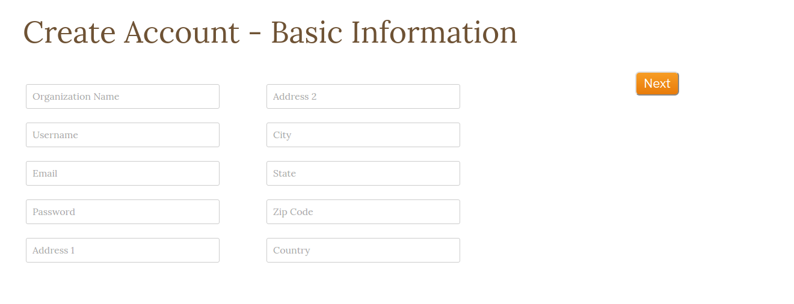
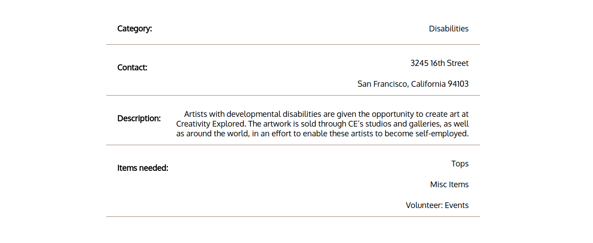
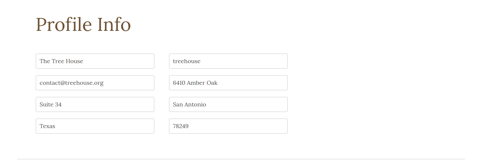

## Registry Care

[Live link](https://registry-care.herokuapp.com/#/?_k=m0qytc)

Registry Care is a web application inspired by Thankful Registry (formerly Registry Love), for not-for-profit organizations to create registries for needed resources. It is built using Ruby on Rails on the backend, a PostgreSQL database, and vanilla JavaScript and React.js with a Redux architectural framework on the front-end.


Fig 1. Splash page

### Features and Implementation

#### User Authentication
The App features user authentication in the form of Login and Signup functionalities.


Fig 2. Login modal

Signing up involves traversing through several information-gathering forms, including a form for uploading profile pictures, which are saved and optimized using the Cloudinary CDN.


Fig 3. Signup - basic information


Fig 4. Signup - select organization's category


Fig 5. Signup - select needed items and create account

Sensitive information is kept out of the front end of the app. Custom authentication methods are used to store hashed and salted passwords. The app makes API calls to the SessionController to fetch or create users.

There are also two "tour" buttons on the homepage, as well as "Guest Login" link in the header for guests to log in and experience the site as if they have an account.


Fig 6. Signup - Login as guest

On the back-end, user information (contact info, photo url, and description) are stored in one table. User is linked to the categories by establishing a user-category join model, and similarly with items via user-items join model.

#### Index
Once the user is logged in, they will be brought to the index page, which displays all the participating organizations. The user can also return to the index page from elsewhere by clicking on the heart logo and "Care"  on the top left corner of the header. From here, the user can click on a picture with the logo of the organization and be directed to that organization's "registry". The index is styled using the React Masonry library which animates the entrance of the organization profiles.


Fig 7. Index

#### Search
In the center of the header there is a search bar which brightens when the user interacts with it by hovering with the mouse or clicking in the search field.

A filtered index is displayed when search terms are entered. The search bar responds to text changes in the input field, each of which dispatches an ajax call to fetch the relevant organizations from the database and re-renders the index page, displaying the search results. Search terms could be part of an organization's title, a category, or an item. The search function called by the UsersController#index lives in the User model:

```
def self.search(query)
 User.joins(:user_categories, :categories, :user_items, :items).where("categories.name ILIKE ? OR organization_name ILIKE ? OR items.name ILIKE ?", "%#{query}%", "%#{query}%", "%#{query}%").distinct
end
```


Fig 8. Search bar inactive


Fig 9. Search keyword "children"


The backend views utilizes Jbuilder to generate the appropriate JSON data feeds. The index view uses this syntax:

```
json.array! @users do |user|
  json.partial! "api/users/user", user: user
end
```

which in turn uses a partial to extract all the necessary information from a user:

```
json.extract! user, :id, :username, :organization_name, :email,
                    :address1, :address2, :city, :state, :zipcode,
                    :photo, :description, :latitude, :longitude

json.items do
  json.array! user.items
end

json.category user.category

json.pledges do
  json.array! user.pledges
end
```

#### Registry
The registry shows the organization's title, category, address, purpose, and gives a list of items that they need. At the bottom Google Maps API is integrated into the app to show the location of the organization.


Fig 10. Registry shows profile photo



Fig 11. Registry shows profile info


Fig 12. Registry shows location


API keys are kept out of public access via the use of the figaro gem.


#### Profile

The organization can edit their info any time by accessing their profile via the link on the top-right corner of the header, to the left of the logout link. The user has to be logged in to see this link.


Fig 13. Change information


Fig 14. Change profile photo

Category and Items selections are pre-selected based on current information.


### Future Directions for the Project

Future improvements will include:
- adding a user interface for individual donors to create an account, save organizations of interest, and make pledges to donate items.
- adding directions functionality to the maps API
- adding a direct payment API so users can donate money directly to organizations
